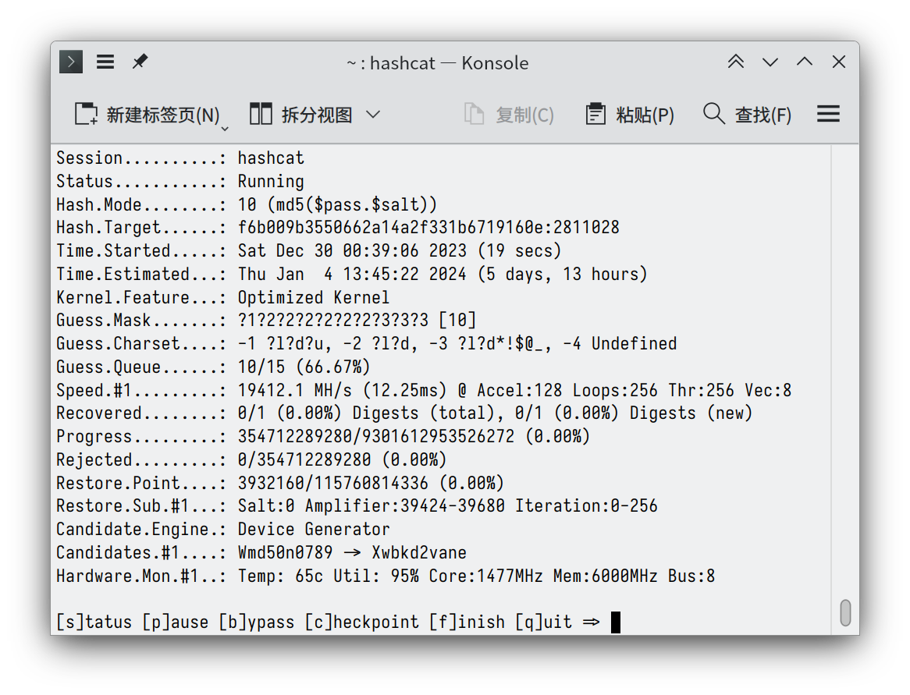

ACMOJ 在 2023 年 12 月 21 日凌晨进行了停机维护，将密码存储的摘要算法由 SHA512 迁移到了 Argon2。我们将在这篇文章里分享这次维护的原因和过程。

<!--more-->

[如果你对密码存储已经很了解了，可以点击此处跳转到技术部分。](#technicalities)

每次当你登录 ACMOJ 的时候，你都会把你的密码发给 ACM 班的服务器。服务器会检查你提供的密码和数据库里用户的密码是否匹配，然后会允许或者拒绝你登录。你有没有好奇过，你的密码是怎么存储在服务器上的？

如果这是一个课程大作业（比如说 [Bookstore][bookstore]）的话，你可能会把密码直接存储在数据文件里。这样做的缺点是显而易见的：任何人只要拿到了数据文件，就可以立即知道所有人的密码。如果服务器被恶意者攻破，他也将知道所有人的密码。得到密码的人会在其他平台上尝试用这些密码登录，因为你的密码很可能用在了不只一个网站上。

[bookstore]: https://github.com/ACMClassCourse-2023/Bookstore-2023/blob/main/requirements.md

一个稍微好一些的做法是使用一个[散列函数][hash]（[hash function][hash-en]），存储密码经过函数计算得到的散列值 `hash(pass)`。在比对密码的时候，只需要重新算出密码的散列值，然后与数据库比对即可。对于一个密码学安全的散列函数来说，没有任何算法能有效地从散列值逆向计算出原来的密码。但是，我们可以对于一些常见的密码和较短的文本预先计算好它们的散列值（计算得到的映射表一般称为[彩虹表][rainbow]），通过非法途径获得用户密码的散列值之后，就可以直接查表来获得原始的密码。

[hash]: https://zh.wikipedia.org/wiki/%E6%95%A3%E5%88%97%E5%87%BD%E6%95%B8
[hash-en]: https://en.wikipedia.org/wiki/Hash_function
[rainbow]: https://zh.wikipedia.org/wiki/%E5%BD%A9%E8%99%B9%E8%A1%A8

为了应对这个问题，我们会将每个用户的密码后面拼接上一个随机字符串（这个字符串一般称为 salt），然后再存储 `hash(pass + salt)`。Salt 的值明文存储在数据库中，对每个用户是不同的。由于 salt 具有较强的随机性，对「加盐」之后的密码进行打表不具有可行性，所以这样就防范了彩虹表攻击。

随着算力的进步，我们发现，对于一般的散列函数来说，我们可以直接暴力遍历所有可能的密码，算出它们的散列值，然后进行比对。在笔者的笔记本上（配备 RTX 3060 Max-Q），已经可以在较短的时间内暴力破解一个较长的密码。

这是因为，传统的散列函数在设计的时候，会让计算进行的尽可能快；而密码存储这一应用场景下，我们恰恰需要计算慢一些。所以，在现代的系统中，我们通常使用专为密码存储而设计的散列函数，例如 bcrypt, scrypt, PBKDF2 和我们选用的 Argon2。计算这些函数通常需要几十到几百毫秒。如果使用 MD5，我们可以轻松达到 200 MHash/s；而这些算法可能只能达到 200 Hash/s。这样就保证了密码无法被暴力枚举。

**友情提示：无论采用什么存储方式，使用 `12345678` 或者 `password` 这样的密码都是极度不安全的。请尽量减少密码在不同网站间的重复使用。**

我们现在所使用的 ACMOJ 是 2020 年上线运行的。[自运行之初，我们使用的就是 `sha512(pass + salt)` 的算法来存储密码。][beginning]这样存储显然不是最安全的方式。在 2023 年 12 月 21 日凌晨，我们将密码存储的摘要算法由 SHA512 迁移到了 Argon2。

[beginning]: https://github.com/ACMClassOJ/TesutoHime/commit/fbe47d22682b27209b4f165ffdad4fec48de4a00#diff-1138b62fb47ccf5d5fc8acb3726a4a086002b089575b2c798bada3dbe9ae3f27R7

由于 SHA512 已经能提供一定程度的安全性，我们在迁移的时候，没有办法直接从 `sha512(pass + salt)` 计算出 `argon2(pass + salt)`；为了给所有用户提供更高的安全性，我们又需要将所有密码转换为新算法。为了达到这个目的，我们采用了一种中间格式：`argon2(sha512(pass + salt1) + salt2)`。这是一个大概的时间线：

1. 数据库中的密码是 `hash1 = sha512(pass + salt1)`；
1. 计算 `hash2 = argon2(hash1 + salt2) = argon2(sha512(pass + salt1) + salt2)` 并填入数据库；
1. 在迁移后用户第一次登录时，重新计算 `hash2(pass-provided)`，与数据库里的散列值进行比对。如果登录成功，由于用户提供了正确的密码，我们就可以计算 `hash3 = argon2(pass + salt)` 了，我们把这个值填入数据库；
1. 在后续登录时，将密码与数据库里的 `hash3` 比对即可，无需经过中间格式。

有些用户大概永远都不会登录 OJ 了，所以中间格式会一直存在于数据库里。这是完全没有问题的，因为中间格式 `hash2` 所带来的安全性并不比 `hash3` 弱。

我在 12 月 17 日写完了迁移的相关代码，经过几天的测试，12 月 20 日凌晨，我们进行了迁移操作。但由于迁移过程中需要为数据库中五千多位用户计算 `hash2`，迁移脚本还没写并行，导致计算时间完全无法接受。我临时把脚本替换成了并行计算的版本，但是中途遇到了问题。在预定的时间窗口内无法完成迁移，所以我们回滚了数据库（进行数据库迁移之前一定要备份数据！），暂时回退到了 SHA512。

并行计算的逻辑是这样的：我们先将数据库导出，让每个线程处理一些用户的密码，将中间格式输出，然后将输出汇总起来，导入数据库。但是，在输出到一半的时候，输出文件中出现了乱码。后来检查发现，Python 的 `print` 函数竟然是线程不安全的：它会把待输出的内容先暂存在一个 buffer 里，但是写 buffer 的这个过程完全没有任何并行控制。所以，同时进行 `print('aaaa')` 和 `print('bbbb')`，输出的不仅可能是 `aabbabab`，还可能是未初始化的内存。

在修复了这个问题之后，我们在 12 月 21 日凌晨继续进行了迁移。这次，我们在某云平台上创建了一个 64 核的虚拟机用来计算 Argon2，在一分多钟内就计算结束了，顺利完成了迁移。

以下是这个过程中我的一些思考：

- 在计划数据库迁移的时候，需要估计一下迁移所需的时间。在测试环境下，一共只有不超过 10 个用户，任何操作都会进行得很快。
- 如果用户的规模再大一些，或者不想中断服务，可以让 Web 服务器同时支持验证 SHA512、中间格式和 Argon2 的密码，然后使用一个后台程序逐步进行计算和迁移。
- ~~Python 是一个设计的很差的语言。~~

**再次提示：在任何情况下，使用 `12345678` 或者 `password` 这样的密码都是极度不安全的。请尽量减少密码在不同网站间的重复使用。**
