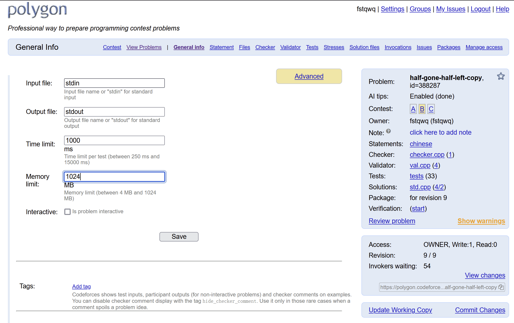
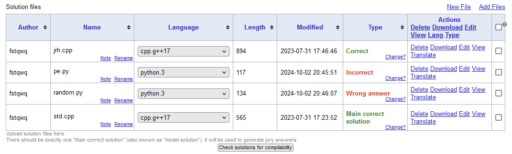

> ACMOJ 最近加入了对 testlib 和 I/O 交互题的支持。fstqwq 作为资深算法竞赛选手和 ACMOJ 的长期用户，为这些功能提出了很多建议。我们邀请他对这些特性做了一个简要的介绍。

<!--more-->

### testlib.h

testlib 是一个算法竞赛通用的校验器、检查器库文件，能够按照需求支持一系列检查工作：如忽略空白字符、浮点数相对或绝对精度，以及最重要的，给 spj 程序提供模板函数，减少需要的特殊检查（举例：检查选手是否在应当输出浮点数的地方输出了 ``"nan"``）。与之配套的，是 [Codeforces Polygon](https://polygon.codeforces.com/)。Polygon 支持一套完整的出题工作流，支持题面 gpt 查错、数据生成、严格检验数据、在所有参考（正确、错误）代码上运行测试、对拍（Stress test）造数据、类似 git 的版本控制和协作系统（Subversion），以及一键导入 Codeforces Mashup / Gym 的功能。由于其工作流能极大降低题目出错概率，以及 Codeforces 的影响力，testlib.h 已经成为了某种事实标准。

#### 如何使用 testlib.h

你现在可以直接上传使用 `testlib.h` 的 checker 作为 `spj.cpp`；我实现了一个 [Polygon 包转换为 ACMOJ 的转换工具](https://github.com/fstqwq/Polygon2ACMOJ)，可以一键导入 Polygon 上使用 `testlib.h` 作为 checker 的一部分的题目。欲了解更多关于使用 Polygon 的信息，请参考[附录](#附录codeforces-polygon-简易使用指南)。

### I/O 交互题

大多数题目是运行一次后比较输出结果。如果需要裁判程序和选手程序进行交互，那么在 ACMOJ 上传统的解决方法是使用实现函数的方法，将裁判程序和选手程序一起运行，例如 [1302](https://acm.sjtu.edu.cn/OnlineJudge/problem/1302) 题。

显然，这种解决方式并不完美：

* 裁判程序需要写得非常繁琐。
* 但是，选手仍可以尝试攻击裁判程序来获得分数，例如读取裁判程序的代码或者内存区域内容，替换掉输入输出文件，或者提前结束程序。

I/O 交互可以避免这个问题。此时，选手程序和裁判程序运行在两个沙箱里，以管道的形式通信。选手唯一能够作弊的方式是向管道里输出导致裁判程序异常的内容，而这种问题相对好规避（一种方法是使用 `testlib.h`）。同时，I/O 交互不限制选手提交语言，因此只要 OJ 支持，你可以用任意语言提交代码评测。

交互题可以完成很多有趣的功能：

* 强制选手程序在线回答问题。
* 限制选手的询问复杂度而非时间复杂度，例如上文里的要求实现归并排序。
* 实现某些性质测试类问题：我举三个例子，[Riddle of the Sphinx](https://qoj.ac/contest/1662/problem/8674), [Is it rated?](https://codeforces.com/problemset/problem/1510/I), [QC QC](https://qoj.ac/contest/782/problem/2167)。在这类问题里，算法竞赛中不常见的算法很可能会获得优势。
* 在询问性质类问题时，裁判程序可以自适应地让选手程序陷入最差的局面：例如大小猜数字时，如果选手的划分不均匀，那么永远走向较差的一边。
* 和选手下棋：对于棋类游戏来说，你可以实现若干个标准裁判程序。当选手和某个标准程序下棋有 $\frac 1 2 - \varepsilon$ 的胜率时，就认为选手通过。

#### 如何创建交互题

在 `config.json` 里设置

```json
  "SPJ": {
    "Run": "interactive"
  }
```

即可。此时，包内可以传入 `interactor.cpp` 或者可执行文件 `interactor`。你可以使用 Python 作为 interactor，此时在第一行写入 `#!/usr/bin/env python3` 即可。

interactor 的命令行参数是：`./interactor input output`。

- input 是题目的输入文件（#.in），此文件对选手不可见。如果不存在输入文件则为 /dev/null。
- output 是输出。对此文件的输出会交给 checker 进行检查，若 Check=skip 则会直接作为评测结果：第一行应是一个 $[0.0,1.0]$ 的数，表示得分占测试点总分的比例，0 为不得分，1 为满分（accepted），其余内容会作为测试点的评测消息展示给选手。
- interactor 的 `stdin` 和 `stdout` 分别与选手程序的 `stdout` 和 `stdin` 绑定，向标准流输入输出即可完成交互。
- **为了使得评测能够进行下去，选手程序和裁判程序应当在输出每一行后主动 flush 输出流：例如 `fflush(stdout)` 或者使用 `std::cout << std::endl` 换行。否则，可能会导致交互死锁造成 TLE。**

前文提到的转换工具可以直接转换 Polygon 交互题包为 ACMOJ 题目包。默认情况下，testlib 会认为不使用另外的 checker，需要在 config.json 中指定 SPJ.Check = skip：

```json
  "SPJ": {
    "Run": "interactive",
    "Check": "skip"
  }
```

如果需要使用 compare checker 或者自定义 checker（例如 [testlib 中的测试题目][testlib-interactive]），需要在调用 `registerInteraction` 时传入第三个参数为 false：

```cpp
registerInteraction(argc, argv, false);
```

[testlib-interactive]: https://github.com/ACMClassOJ/testlib/blob/8428edfb36978731b0fdeece5f902e02e551545c/interactors/interactor-a-plus-b.cpp

#### 注意事项

通常，交互题会给选手带来一些测试上的困扰。请在交互题里务必注意：

- 强调输出每行后要使用 flush 刷新缓冲区；
- 如果可能的话，给选手提供一个测试工具。你可以使用 Python 的 subprocess 来创建管道，例如 [Riddle of the Sphinx](https://qoj.ac/contest/1662/problem/8674) 题目的[附加文件](https://qoj.ac/download.php?type=problem&id=8674&contest_id=1662)里的 testing_tool.py。
   - 可以参考 ACMOJ 提供的[交互题测试工具](/OnlineJudge/static/assets/test-interactive.py)。

### 附录：Codeforces Polygon 简易使用指南

#### 基本流程

注册账号即可，注意 Polygon 的账号和 Codeforces 是独立的。

新建一道题目，你可以看到类似以下的界面。



你需要在 Statements 中写入 LaTeX 题面，在 checker 中选择标准检查器或者自定义检查器，在 validator 中实现数据校验器，并在 tests 中造数据，在 solutions 里传入参考代码，并使用下面的 verification 进行测试，在上面的 invocation 里查看代码运行结果（如果在数据生成、标程编译运行等方面出错，你应该在 verification 的 failed 上悬浮查看原因）。

我们以图例题目为例做说明。题目是：

> 给定一个有 $n \leq 1000$ 个顶点和 $m \leq 1000$ 条边的图，找到一个包含至少一半边的子图，使得其为*二分图*。 换句话说，你需要为每个顶点分配一种颜色，黑色或白色，且两个顶点之间不同颜色的边的数量应至少为 $\lceil \frac m 2 \rceil$。

对于不需要判断多解的题目，大多数使用标准 checker lcmp 或者 wcmp 即可。本题需要接受多解，一个可能的 checker 实现如下：

```cpp
#include "testlib.h"
#include <bits/stdc++.h>
using namespace std; 
int n, m;
vector < pair <int, int> > e;
 
void readAndCheckAnswer(InStream& in) {
    int w = (m + 1) / 2;
    vector <int> a(n + 1);
    for (int i = 1; i <= n; i++) {
        a[i] = in.readInt(0, 1, "c_i");
    }
    
    for (auto [u, v] : e) {
        if (a[u] != a[v]) w--;
    }
    
    if (w > 0) {
        in.quitf(_wa, "need %d more edges", w);
        // when jury's solution is WA, it will quit as FAILED
    }
}
int main(int argc, char* argv[]) {
    registerTestlibCmd(argc, argv);
    n = inf.readInt();
    m = inf.readInt();
    for (int i = 1; i <= m; i++) {
        int u, v;
        u = inf.readInt();
        v = inf.readInt();
        e.push_back({u, v});
    }
    readAndCheckAnswer(ans); // validate jury's solution
    readAndCheckAnswer(ouf); // validate participant's solution
    quitf(_ok, "n=%d, m=%d", n, m);
}

```

一个可能的 validator 实现如下：

```cpp
#include <bits/stdc++.h>
#include "testlib.h"
 
using namespace std;
 
int main(int argc, char* argv[]) {
    registerValidation(argc, argv);
    int n = inf.readInt(2, 1000, "n");
    inf.readSpace();
    int m = inf.readInt(1, 1000, "m");
    inf.readEoln();
    set < pair <int, int> > s;
    for (int i = 1; i <= m; i++) {
        int u, v;
        u = inf.readInt(1, n, "u_i");
        inf.readSpace();
        v = inf.readInt(1, n, "v_i");
        inf.readEoln();
        ensuref(u != v, "no self loop");
        if (u > v) swap(u, v);
        ensuref(s.count(make_pair(u, v)) == 0, "no duplicate edges");
        s.insert (make_pair(u, v));
    }
    inf.readEof();
}
```

事实上，绝大多数 validator 和 checker 都是平凡的，你可以使用 gpt 帮你生成，方法是：

```text
请使用 testlib.h 生成以下题目的 validator 和 checker。
[全文粘贴题目，格式乱了无所谓]
```

然后，你可以上传标准程序，以及一些错误程序：比如本题随机给每个点染色，运行若干次直到满足条件是正确做法，但只随机一次是错误做法。你需要给每个做法打上正确的标记。



随后应当上传测试数据，大数据可以使用 generator 生成以避免直接上传。使用 testlib 的随机数生成器 `rnd` 可以确保结果稳定，并可以通过 generator 的最后一个参数来指定随机种子，来使用 Stress test 功能制造一些对拍出来的卡掉某些做法的测试点。

最后运行 verification，没问题后 commit。commit 完后可以生成 package。

#### 创建测试比赛

在 package 创建成功后，如果你需要例如请别人验题，可以使用 Codeforces 的 Mashup 功能直接创建，粘贴 Polygon 的题目或者比赛 uid 即可。

#### 导入到 ACMOJ

在 package 里选择 linux 下载，其中根目录下有 check.cpp，`tests/` 下有所有运行完毕的测试点，格式为 `[test id] [test id].a`，使用脚本命令批量重命名就可以使用了。

你也可以使用 [前文提到的这个脚本](https://github.com/fstqwq/Polygon2ACMOJ) 来转换题目格式。例如，将 half-gone-half-left-9$linux.zip 打包为 ACMOJ 题号 1234 包格式：

```sh
python3 pol2acm.py 'half-gone-half-left-9$linux.zip' -o 1234
```

#### 中文题面支持

尽管语言选项里有中文，但是默认情况下的 latex 模板文件并不支持中文。为了输出中文 PDF 题面，你可能需要替换一些文件。你可以参考 [这里](https://github.com/fstqwq/polygon-chinese-template) 进行修改。
