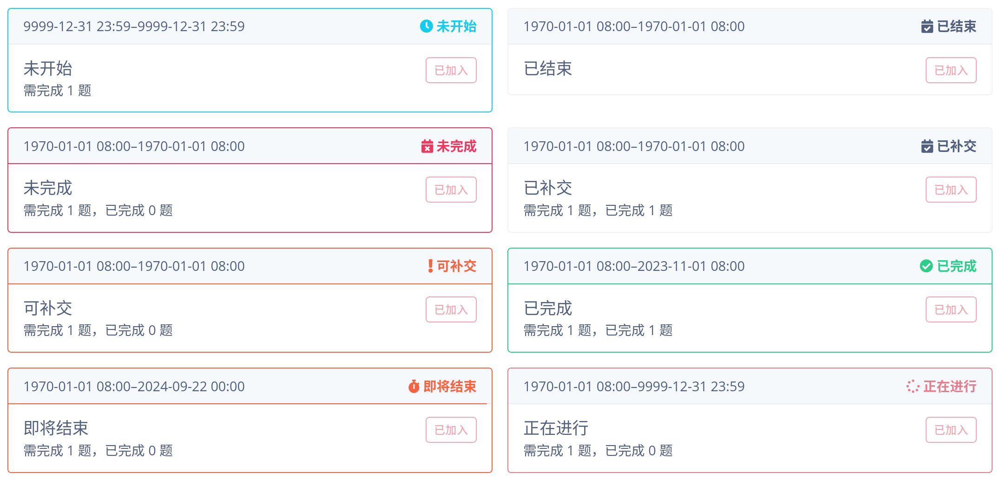

现在，管理员可以在作业管理中设置作业的迟交设置，还可以创建比赛及作业的副本。

<!--more-->

## 迟交

布置作业时，经常会允许一定程度的迟交，并根据迟交时间来进行相应的扣分。在过去，ACMOJ 并未提供对迟交的支持；在实践中，助教经常使用两种方法实现迟交统计：

- 在需要统计时，将作业的截止时间临时延长到迟交的截止时间，统计完成之后再改回去；
- 创建一个新的作业，设置与原作业相同但截止时间不同，统计两个作业的情况。

与 Canvas 等原生支持迟交的平台相比，这两种做法都有诸多不便。

### 使用方法

转到比赛设置之后，在「作业要求」一栏中设置即可。设置之后，如果学生没有按时完成作业，学生将可以在迟交截止日期之前补交作业。

**设置迟交时，强烈建议同时在系统中设置完成情况统计**，否则如果学生在作业截止后、迟交截止前通过了新的、本不需要完成的题目，或者取得了更高的分数，则学生会被记为迟交，因为 OJ 无法判定学生是否按时完成了作业。

例如，一次作业有两道题目，可任选一道完成，但未在 OJ 上设置。一位学生按时通过了一道题目，在截止时间之后，又通过了另一道题目，则此时学生提交的第二题会被认为是迟交。如果设置了作业完成条件，则提交的第二题不会显示在完成情况表上。

设置完成情况统计后，学生界面也将可以看到学生自己的作业完成情况，有助于学生合理规划作业进度。

## 创建比赛及作业副本

ACM 班在机考结束之后，经常要求补题。在过去，助教需要手动创建一个作业，作为补题的作业。现在，助教可以直接创建一个副本，然后将类型修改为作业即可。

创建副本时，将保留比赛的所有设置，但手动加入原比赛的用户并不会自动加入新比赛；由于班级及分组设置而属于原比赛的用户，仍会符合新比赛的自动加入条件，而将自动加入新比赛。
